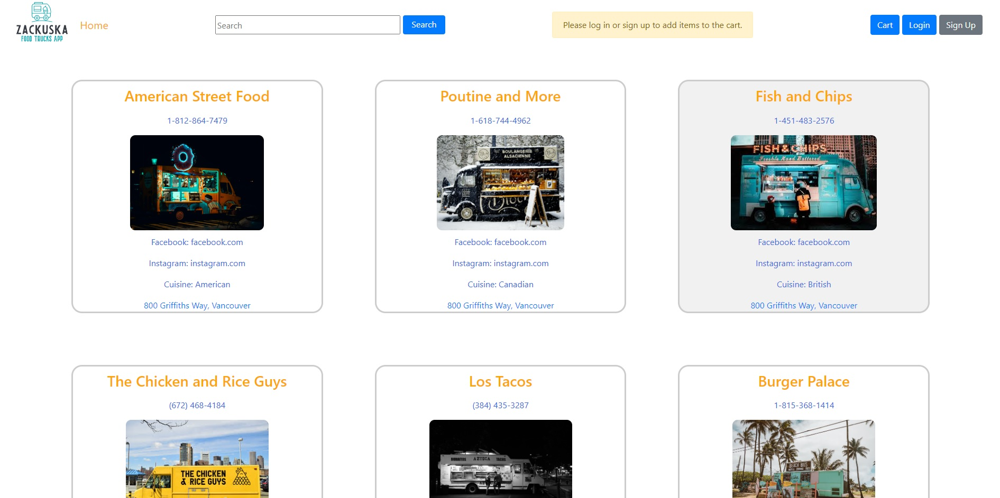
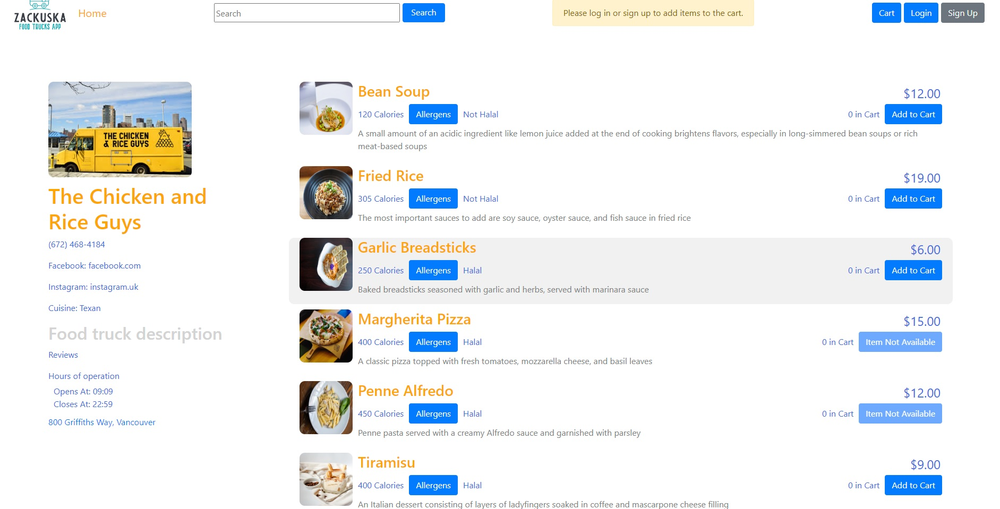
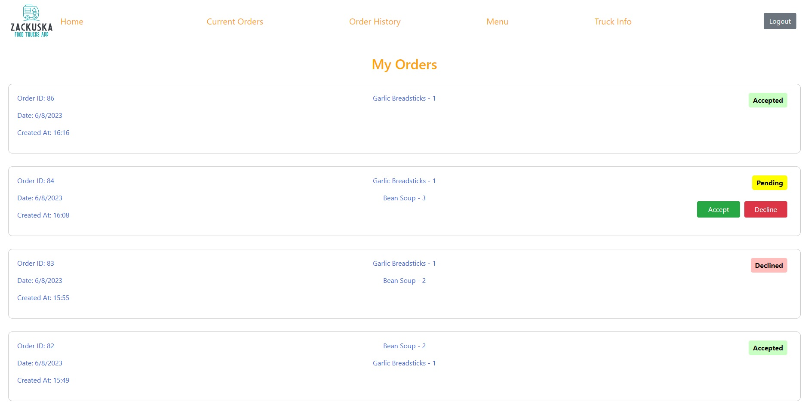

# Zackuska

Welcome to Zackuska, the ultimate app for food lovers and food truck enthusiasts! Our app allows customers to view food trucks in their city and explore their delectable menus. With a simple and intuitive interface, you can browse through a variety of food trucks and discover exciting culinary experiences near you.
We created this app using Javascript, ReactJS, NodeJS, Express Server, and PostgreSQL.



## Getting Started

To get started with Zackuska, please follow the steps below:

1. **Clone the repository**
```
git clone https://github.com/zachmanac/Zackuska.git
```

2. **Install Dependancies**
Install dependancies in each of these folders: Zakuska(main directory), customer-app, and food-truck-app.
```
cd Zackuska
npm install
```

3. **Setup the DataBase**
Initialize the database. This also resets it.
```
npm run db:reset
```

4. **Start the servers**
Have 3 terminals open to run one for each of: API server, customer-app server, and food-truck-app server.

```
cd Zackuska
npm start

cd customer-app
npm start

cd food-truck-app
npm start
```

5. **Access the Application**
Open your web browser and navigate to `http://localhost:3000` to access the customer application.
Navigate to `http://localhost:3001` to access the owner-side application.
The API server runs on port 8000.

For logging into the owner side, the password for all owners is `password`.
These are their emails:
```
1. sed.eget@outlook.org
2. vitae.diam@yahoo.org
3. integer@google.co.uk
4. ac.turpis@google.edu
5. ken@yahoo.org
6. minumun@google.ca
```

For testing purposes, orders are created on click of `Checkout` button.

Please note that these instructions assume you have Node.js and NPM installed.

## Features

### Customer Side

1. **Discover Food Trucks**: On our home page, you can view the list of food trucks in your city. Clicking on a truck will take you to their respective menu. You can click on the truck's address to get the Google Maps directions link to the food truck.

2. **Menu**: On a truck's menu page, you can view the menu and the truck's information. Once logged in, you can add and remove items from your cart. You can find detailed information about each food item, such as the description, calories, and allergens in the dropdown menu once clicked.



3. **Cart and Payment**: On the cart page, you can view your current cart and update the quantities of the items. Once you're satisfied with your order, you can proceed to checkout, which will bring up the Stripe payment form.

4. **Orders**: On the orders page, you can see your current pending orders as well as your order history. The status of pending orders will change once a truck accepts or declines your order.

### Owner Side

1. **Owner Dashboard**: From the owner dashboard, you can navigate to your current orders, order history, menu, or edit truck info pages.

2. **Current Orders**: The current orders page displays your list of orders for the day. For incoming orders, you can choose to accept or decline, which will send the updated status to the customer.



3. **Menu**: On the menu page, you can update all fields for each of your menu items.

